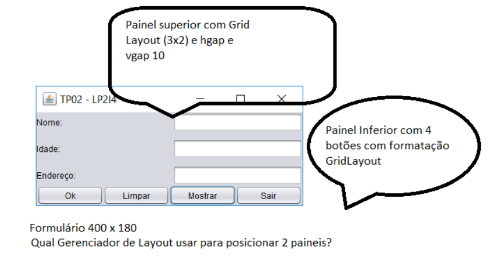

## TP2 - Linguagem de programação Java

1. Desenvolver o seguinte sistema abaixo, empregando os conhecimentos adquiridos nas
aulas sobre interfaces gráficas em java.
 - Criar a seguinte classe Aluno, conforme diagrama:
    

- Implementar o formulário possibilitando ao usuário cadastrar uma lista de alunos,
respeitando as seguintes regras:  
    - Quando o botão Ok for pressionado os dados contidos em tela devem ser armazenados em memória (utilizar a interface List <E> em conjunto com a classe ArrayList<E> para armazenar a lista de alunos
    cadastrados em memória)  
    - Limpar apaga o conteúdo dos labels.  
    - Botão Mostrar exibe o pop-up a ser desenvolvido no item (C) deste trabalho.  
    - Botão Sair encerra a aplicação.

    

- Criar o mecanismo de exibição abaixo, que contempla todos os ids e nomes dos alunos
cadastrados nesta execução do programa, utilizando a classe: `JOptionPane.showMessageDialog(this, mensagem);`
    

### Alunas
- Alice Marinho CB3025772
- Bianca Ribeiro CB3025683